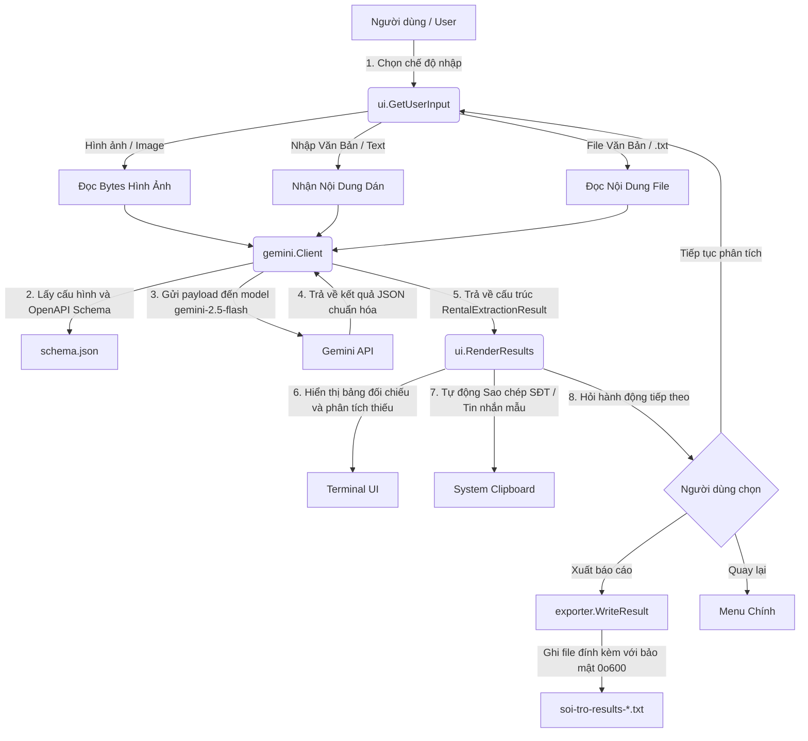

# 🚀 Soi Trọ - Công cụ Phân tích & Trích xuất Tin đăng Thuê phòng bằng AI

**Soi Trọ** là một công cụ dòng lệnh (CLI) mạnh mẽ, hiện đại được viết bằng ngôn ngữ Go (Golang). Công cụ này tích hợp mô hình ngôn ngữ lớn đa phương thức **Gemini 2.5 Flash** để tự động phân tích, trích xuất cấu trúc và chuẩn hóa thông tin từ các tin đăng cho thuê phòng trọ hoặc căn hộ dịch vụ tại Việt Nam (hỗ trợ cả định dạng văn bản lẫn hình ảnh chụp màn hình).

Ứng dụng giúp người tìm phòng trọ phát hiện nhanh các "khoảng trống thông tin" (thiếu giá điện, nước, cọc, máy giặt, v.v.), tự động sao chép số điện thoại hoặc soạn sẵn tin nhắn hỏi chủ nhà cực kỳ tiện lợi chỉ với vài phím bấm.

---

## 🌟 Tính Năng Nổi Bật

- **📷 Phân tích Đa phương thức (Multimodal Input):** Hỗ trợ nhập liệu linh hoạt bằng cách dán văn bản trực tiếp, đọc từ file `.txt` có sẵn hoặc kéo thả file hình ảnh chụp màn hình tin đăng phòng trọ (`.jpg`, `.jpeg`, `.png`, `.webp`) để trích xuất OCR kết hợp phân tích thông tin.
- **⚙️ Quản lý Schema Động:** Cấu trúc dữ liệu đầu ra được quản lý hoàn toàn bằng `schema.json` theo tiêu chuẩn OpenAPI 3.0. Bạn có thể **Thêm, Xóa, hoặc Bật/Tắt các trường bắt buộc (Required Checklist)** trực tiếp thông qua giao diện TUI trực quan mà không cần can thiệp vào mã nguồn.
- **🧹 Bộ Lọc Chuẩn Hóa Dữ Liệu:** Tự động chuyển đổi tiếng lóng và viết tắt phổ biến trong tin đăng phòng trọ:
  - *Giá thuê / Cọc:* `4tr5`, `4.5m` $\rightarrow$ `4,500,000 VND`; `cọc 1t` $\rightarrow$ `Cọc 1 tháng`.
  - *Điện / Nước:* `4k/số` $\rightarrow$ `4,000 VND/kWh`; `100k/ng` $\rightarrow$ `100,000 VND/người`.
  - *Tiện ích:* `free xe` $\rightarrow$ `Miễn phí giữ xe`.
- **🔑 Quản lý API Key Toàn cục (Global Key Storage):** Hỗ trợ lưu trữ API Key tập trung trong thư mục cấu hình người dùng `~/.config/soi-tro/config.json`. Nếu không tìm thấy khóa, ứng dụng sẽ hiển thị form TUI nhập liệu bảo mật (ẩn mật khẩu) để lưu trữ nhanh, giúp chạy chương trình từ bất kỳ thư mục nào mà không cần giữ file `.env`.
- **🔍 Phân Tích Khoảng Trống (Gap Analysis):** Đối chiếu các thông tin trích xuất được với cấu hình Checklist bắt buộc để đưa ra cảnh báo thuộc tính bị thiếu rõ ràng trên giao diện bảng.
- **💬 Soạn Tin Nhắn Tự Động:** Tự động dự thảo **02 mẫu tin nhắn thăm hỏi** (phong cách *Lịch sự* & *Trực diện*) tích hợp địa chỉ tin đăng, sử dụng cặp xưng hô tự nhiên (`mình` - `b/bạn`) để hỏi nhanh các thông tin còn thiếu.
- **📋 Tích hợp Clipboard Thông minh:** Tự động sao chép Số điện thoại chủ nhà (hoặc tin nhắn mẫu nếu không có SĐT) vào clipboard hệ thống ngay khi phân tích xong để người dùng có thể liên hệ Zalo/SMS lập tức.
- **💾 Quản lý Xuất Báo Cáo Bảo Mật:** Hỗ trợ lưu trữ kết quả phân tích tập trung vào các file báo cáo (`soi-tro-results-*.txt`). Hỗ trợ cấu hình thư mục lưu trữ, giới hạn dung lượng file tự động chia nhỏ báo cáo, bảo vệ thông tin cá nhân (PII) bằng cách thiết lập quyền truy cập file nghiêm ngặt (`0o600` - chỉ chủ sở hữu được đọc/ghi).

---

## 🏗️ Kiến Trúc Hệ Thống



---

## 🛠️ Công Nghệ Sử Dụng

- **Ngôn ngữ lập trình:** Go (Golang) 1.22+
- **AI Core:** Official **Google GenAI Go SDK** (`google.golang.org/genai`) powered by `gemini-2.5-flash`.
- **Giao diện Dòng lệnh (TUI):**
  - [Charm Bracelet Huh?](https://github.com/charmbracelet/huh) & [Bubble Tea](https://github.com/charmbracelet/bubbletea) cho các biểu mẫu nhập liệu và menu điều hướng bằng phím mũi tên.
  - [tablewriter](https://github.com/olekukonko/tablewriter) để kết xuất bảng biểu trực quan đẹp mắt.
- **Hệ thống:**
  - [clipboard](https://github.com/atotto/clipboard) quản lý tương tác clipboard đa nền tảng.

---

## 📂 Cấu Trúc Thư Mục Dự Án

```text
soi-tro/
├── cmd/
│   └── main.go                 # Điểm khởi chạy ứng dụng (Main Entrypoint) & Luồng vòng lặp chính
├── internal/
│   ├── analyzer/
│   │   ├── engine.go           # Quản lý và xử lý cấu hình Config của ứng dụng
│   │   └── global_config.go    # Quản lý cấu hình toàn cục (~/.config/soi-tro/config.json) & TUI API-Key
│   ├── exporter/
│   │   └── exporter.go         # Xuất báo cáo kết quả, định dạng đầu ra, phân tách dung lượng file an toàn
│   ├── gemini/
│   │   └── client.go           # Kết nối Gemini API, cấu hình Prompt hệ sinh thái, ánh xạ Schema động
│   └── ui/
│       ├── forms.go            # Thiết lập biểu mẫu nhập liệu đa phương thức bằng Huh/BubbleTea
│       ├── renderer.go         # Vẽ bảng kết quả, xử lý clipboard & hiển thị tiến trình
│       └── schema_manager.go   # Vòng lặp quản lý thêm/xóa/sửa cấu hình Schema & Export settings
├── schema.json                 # Tệp OpenAPI 3.0 Schema dùng chung, thiết lập trường bắt buộc & xuất file
├── Taskfile.yml                # Công cụ chạy tác vụ nhanh (Taskrunner) của dự án
└── .env                        # Chứa các biến môi trường cấu hình nhạy cảm (như GEMINI_API_KEY)
```

---

## 🚀 Hướng Dẫn Cài Đặt & Sử Dụng

### 1. Yêu cầu hệ thống
- Máy tính đã cài đặt **Go (Golang)** phiên bản **1.22** trở lên.
- Một **Gemini API Key** hoạt động (bạn có thể nhận miễn phí tại [Google AI Studio](https://aistudio.google.com/)).

### 2. Tải các thư viện phụ thuộc
Di chuyển vào thư mục dự án và chạy lệnh sau để tải các package cần thiết:
```bash
go mod tidy
```

### 3. Thiết lập biến môi trường (Tùy chọn)
Soi Trọ hỗ trợ cấu hình cực kỳ linh hoạt và an toàn:
- **Cách 1 (Khuyên dùng):** Không cần tạo file gì cả. Trong lần đầu khởi chạy, ứng dụng sẽ tự động hiển thị form nhập liệu CLI bảo mật và lưu khóa API toàn cục của bạn tại `~/.config/soi-tro/config.json`.
- **Cách 2:** Thiết lập biến môi trường trực tiếp trên terminal của bạn (ví dụ: `$env:GEMINI_API_KEY="..."` trên PowerShell).
- **Cách 3:** Tạo một file `.env` tại thư mục gốc của dự án với nội dung như sau:
  ```env
  GEMINI_API_KEY="MÃ_API_KEY_GEMINI_CỦA_BẠN"
  ```

### 4. Khởi chạy ứng dụng
Bạn có thể khởi chạy chương trình bằng nhiều cách:

- **Sử dụng Task (Khuyên dùng):**
  ```bash
  task run
  ```
- **Chạy trực tiếp bằng lệnh Go:**
  ```bash
  go run ./cmd/main.go
  ```

---

## 📦 Đóng gói ứng dụng (Build)

Để biên dịch ứng dụng thành một file thực thi độc lập (binary):

```bash
# Biên dịch file thực thi
task build

# Dọn dẹp các tệp dư thừa sau build
task clean
```

Ứng dụng sau khi build sẽ cho ra file `soi-tro.exe` (trên Windows) hoặc `soi-tro` (trên Linux/Darwin). Bạn chỉ cần copy file này kèm theo tệp `schema.json` và `.env` để có thể sử dụng ở bất kỳ đâu.

---

## 🔒 Chính Sách Bảo Mật & An Toàn Dữ Liệu

Ứng dụng được thiết kế tuân thủ nghiêm ngặt các quy tắc kỹ thuật:

- **🔑 Bảo mật Thông tin Nhạy cảm (Secrets Management):** Bảo vệ API Key của bạn một cách an toàn và tối ưu:
  - Khóa API được lưu trữ an toàn bên ngoài thư mục chứa mã nguồn (mục tiêu ngăn chặn tuyệt đối rò rỉ mã bảo mật trên Git History) thông qua hệ thống lưu trữ toàn cục hoặc `.env` được cấu hình trong `.gitignore`.
  - Khi thiết lập khóa lần đầu qua TUI, API Key được ẩn bảo mật (`huh.EchoModePassword`) nhằm chống tấn công nhìn trộm màn hình (shoulder-surfing).
  - Thư mục lưu cấu hình toàn cục được khởi tạo với quyền truy cập nghiêm ngặt `0o700` (chỉ duy nhất chủ tài khoản hệ điều hành có quyền đọc/ghi/truy cập) và file JSON được thiết lập phân quyền bảo mật tối đa `0o600`.
- **🛡️ Bảo vệ PII (Thông tin cá nhân):** Các file xuất kết quả chứa thông tin số điện thoại liên hệ của chủ nhà được phân quyền `0o600` nhằm ngăn chặn các tiến trình không có thẩm quyền trên cùng hệ thống đọc được dữ liệu nhạy cảm.
- **🚫 Chống lỗi tràn dẫn xuất (Path Traversal Prevention):** Mọi đường dẫn thư mục lưu file do người dùng cung cấp đều được chuẩn hóa sang đường dẫn tuyệt đối (`filepath.Abs`) trước khi thực hiện các tác vụ tạo tệp tin, ngăn chặn triệt để hành vi cố tình leo thang cây thư mục hệ thống.

---

## 📄 Giấy phép
Dự án được phân phối dưới giấy phép **MIT License**. Xem chi tiết tại tệp `LICENSE`.
